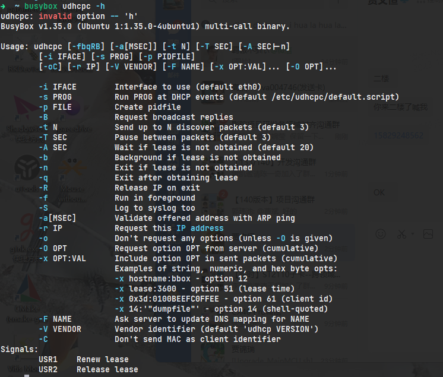

# 😁 嵌入式系统中使用udhcpc

basybox中提供了一组ip管理工具：udhcpc和udhcpd

> [https://m033010041.github.io/2019/04/20/udhcpc-option/](https://m033010041.github.io/2019/04/20/udhcpc-option/)

其实 busybox udhcpc 可以实现许多很实用的功能，例如

* 定时更新IP与租约
* 背景执行 （与 linux 背警执行的 & 不同，要看其他 option 来做变化）
* 立即取得租约
* 可以控制 udhcpc 本身 process 的动作

<figure><figcaption></figcaption></figure>

udhcpc可以运行在服务模式下，他的主要逻辑会建立一个循环，事件循环有如下几种状态：

* 0：INIT 状态，表示客户端正在初始化过程中，还没有收到任何 DHCP 消息。
* 1：REBOOTING 状态，表示客户端正在重启过程中，已经收到了 DHCPDISCOVER 和 DHCPOFFER 消息。
* 2：BOUND 状态，表示客户端已经成功获取了 IP 地址和其他配置信息，并且与服务器建立了连接。
* 3：RELEASED 状态，表示客户端已经释放了 IP 地址和其他配置信息，并且与服务器断开了连接。
* 4：REQUESTING 状态，表示客户端正在请求续约或释放租约过程中。
* 5：RENEWING 状态，表示客户端正在续约租约过程中。
* 6：REVOKING 状态，表示客户端正在终止租约过程中。

过程中可以使用信号对他进行控制：（有三个信号）

* 当接收到 SIGUSR1 信号时，表示用户要求续约或重启 DHCP 客户端。根据客户端当前的状态，执行以下操作：
  * 如果客户端正在请求或重新绑定状态，不做任何操作，继续等待服务器的回复。
  * 如果客户端已经绑定或正在续约状态，尝试向服务器发送续约或重新绑定请求，进入续约请求状态。
  * 如果客户端已经续约请求状态，表示收到了两次 SIGUSR1 信号，重新开始 DHCP 过程，释放当前的 IP 地址，进入初始化选择状态。
  * 如果客户端已经释放状态，表示收到了 SIGUSR2 信号后的 SIGUSR1 信号，重新开始 DHCP 过程，进入初始化选择状态。
* 当接收到 SIGUSR2 信号时，表示用户要求释放 DHCP 租约。向服务器发送释放请求，释放当前的 IP 地址，进入无监听状态，等待下一次信号。
* 当接收到 SIGTERM 信号时，表示用户要求退出 udhcpc。打印收到 SIGTERM 的信息，退出主循环，结束 udhcpc。

我们直接用 bash 的指令直接说明，以下是我在公司工作时被要求需要达到的网络功能

1. 希望网络要到的时候会产生一个 pid file： `/var/run/udhcpc-<IFACE>.pid`
2. 希望可以发送三次 udhcpc 的 requeset 封包 （实验过后觉得发送三次最适当）
3. 希望没有要到的时候可以每 60 秒尝试再要一次 ip address

就以上三点，我们可以直接使用刚刚提到的 option 组合来实现：\
`udhcpc -i <IFACE> -p /var/run/udhcpc-eth0.pid -b -t 3 -A 60`

理论上要不到ip，会进入背景，并且 重启  60 sec之后才会再丢3次discover封包，若可以要到的话，就可以直接要到IP，daemon还是会存在，若要不到的话，会重新计数 retry时间，然后60s后自动要到ip address

```c
int start_udhcpc()
{
    int pid = 0;
    // 这个函数负责启动dhcp服务，并获取进程的pid返回
    int ret = remove("/tmp/udhcpc0.pid");
    
    ret = system("start_dhcp.sh 0 start");
    if (ret < 0) {
        return -1;
    }
    // 以及尝试过阻塞了，但就是没读取到，索性延迟一会，以后就用这一个pid了，基本不需要release
    sleep(1);
    for (int i = 0 ; i < 50 ; i++) {
        FILE *fp = fopen("/tmp/udhcpc0.pid", "r");
        if (fp > 0) { 
            // printf("%d \n", fp);
            if (fscanf(fp, "%d", &pid) == 1) {
                fclose(fp);
                break;
            } else {
                fclose(fp);
                return -1;
            }
            
        }
    }
    return pid;
}

   
int stop_udhcpc(int dhc_pid)
{
    // 这个函数停止dhcp服务，实现方法为发送暂停信号
    return kill(dhc_pid, SIGUSR2);
}

int restart_udhcpc(int dhc_pid)
{
    // 重新启动dhcp服务，发送SIGUSR1信号到dhcp服务中
    return kill(dhc_pid, SIGUSR1);
}

int release_udhcpc(int dhc_pid)
{
    return kill(dhc_pid, SIGTERM);
}
```

其中 start\_dhcp.sh 脚本中的实现如下：

```sh
#!/bin/sh

# Description and Name of the process
DESC="udhcpc"
NAME="udhcpc"
# Path to the udhcpc executable
DAEMON="/home/emb/workspace/Linux_C_ethernet/build/netinformation/udhcpc"
# Additional options for udhcpc
#UDHCPC_MASTER_OPTIONS="-b -i eth0"  # Replace "eth0" with your network interface name

PIDFILE0="/tmp/udhcpc$1.pid"  # Define the path to the PID file


case "$2" in
	start)
		echo -n "Starting $DESC: $NAME... "
		"$DAEMON" -b -i eth$1 -p "$PIDFILE0" & # Start udhcpc and write its PID to the PID file
		echo "done."
		;;
	stop)
		echo -n "Stopping $DESC: $NAME... "
        if [ -f "$PIDFILE0" ]; then
            PID=$(cat "$PIDFILE0")
            if [ -n "$PID" ]; then
                kill -TERM "$PID"  # Send SIGTERM signal to the process
                rm -f "$PIDFILE0"  # Remove the PID file
                echo "done."
            else
                echo "Process PID0 not found."
            fi
        else
            echo "PID0 file not found."
        fi
		;;
	restart)
		echo "Restarting $DESC: $NAME... "
		$0 stop
		sleep 1  # Give some time for the process to stop
		$0 start
		echo "done."
		;;
	*)
		echo "Usage: $0 {start|stop|restart}"
		exit 1
		;;
esac

exit 0
```

调用测试程序如下：

<figure><figcaption></figcaption></figure>

<pre class="language-c"><code class="lang-c">int main() {
<strong>    int dhc_pid = start_udhcpc();
</strong>    printf("udhcpc start pid %d\n", dhc_pid);
    int ret = 0;
    
    sleep(20);
    ret = stop_udhcpc(dhc_pid);
    if (ret &#x3C; 0) {
        printf("stop failed %d ret = %d\n", dhc_pid, ret);
        dhc_pid = start_udhcpc();
        printf("restart dhc %d\n", dhc_pid);
    } else {
        printf("udhcpc stop successful %d\n", dhc_pid);
    }
    sleep(3);
    ret = restart_udhcpc(dhc_pid);
    if (ret &#x3C; 0) {
        printf("restart failed %d ret = %d\n", dhc_pid, ret);
        dhc_pid = start_udhcpc();
        printf("restart dhc %d\n", dhc_pid);
    } else {
        printf("udhcpc restart successful %d\n", dhc_pid);
    }

    sleep(3);
    ret = release_udhcpc(dhc_pid);
    if (ret &#x3C; 0) {
        printf("stop failed %d ret = %d\n", dhc_pid, ret);
        dhc_pid = start_udhcpc();
        printf("restart dhc %d\n", dhc_pid);
    }

    ret = restart_udhcpc(dhc_pid);
    if (ret &#x3C; 0) {
        printf("stop failed %d ret = %d\n", dhc_pid, ret);
        dhc_pid = start_udhcpc();
        printf("restart dhc %d\n", dhc_pid);
    } else {
        printf("udhcpc restart successful %d\n", dhc_pid);
    }
    sleep(3);
    ret = stop_udhcpc(dhc_pid);
    if (ret &#x3C; 0) {
        printf("stop failed %d ret = %d\n", dhc_pid, ret);
        dhc_pid = start_udhcpc();
        printf("restart dhc %d\n", dhc_pid);
    } else {
        printf("udhcpc stop successful %d\n", dhc_pid);
    }
    sleep(3);
    ret = release_udhcpc(dhc_pid);
    if (ret &#x3C; 0) {
        printf("stop failed %d  ret = %d\n", dhc_pid, ret);
        dhc_pid = start_udhcpc();
        printf("restart dhc %d\n", dhc_pid);
    } else {
        printf("udhcpc release successful %d\n", dhc_pid);
    }
    
    return 0;
}

</code></pre>

<figure><figcaption></figcaption></figure>

以上便是该程序的执行结果。

DHCP后，程序会自动识别并获取到IP、子网掩码、网关。
